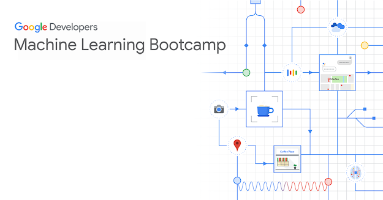

# Google Machine Learning Bootcamp

## What is 'Machine Learning Bootcamp'?

- This program aims to train machine learning developers.
- To complete this program, participants must meet the following two requirements:

  #### Program
    - [**Deep Learning Specialization**](https://www.coursera.org/specializations/deep-learning)

  #### Obtain at least one of the following certifications:
    - [GCP Professional ML Engineer certification](https://cloud.google.com/certification/machine-learning-engineer)
    - [GCP Professional Data Engineer certification](https://cloud.google.com/certification/data-engineer)
    - [**TensorFlow certification**](https://www.tensorflow.org/certificate)

## This repository?
- This repository serves as a primary guide for documenting and reviewing the materials studied in the **Google Machine Learning Bootcamp**.
- It also includes notes and resources from the [**TensorFlow Developer Professional Certificate**](https://www.coursera.org/professional-certificates/tensorflow-in-practice) course taken for certification.

## Deep Learning Specialization
|No.|Course|Note|
|---|---|---|
|1|Neural Networks and Deep Learning||
|2|Improving Deep Neural Networks: Hyperparameter Tuning, Regularization and Optimization||
|3|Structuring Machine Learning Projects||
|4|Convolutional Neural Networks||
|5|Sequence Models||

## DeepLearning.AI TensorFlow Developer Professional Certificate
|No.|Course|Note|
|---|---|---|
|1|Introduction to TensorFlow for Artificial Intelligence, Machine Learning, and Deep Learning|||
|2|Convolutional Neural Networks in TensorFlow|||
|3|Natural Language Processing in TensorFlow|||
|4|Sequences, Time Series and Prediction|||

## Result
- Completed **Deep Learning Specialization**
- Obtained **TensorFlow certification**
